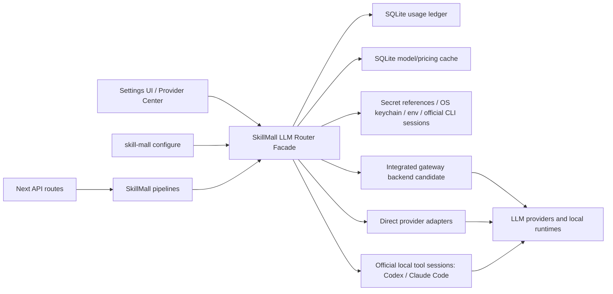

# SkillMall Provider/Auth Router Architecture Plan

Date: 2026-05-19  
Status: Architecture plan for approval only  
Branch: `codex/agent-operating-contract-auth-token-skill`  
Scope rule: no provider/auth implementation, cleanup, staging, commit, or push has been performed by this plan.

This plan supersedes the earlier provider/auth supportability framing where it treated gateway/router/proxy integration as a secondary consideration. That was the wrong shape for the product requirement. SkillMall needs a provider configuration system, a local LLM router/gateway/proxy layer, protected credential handling, broad provider support, auto-updating model lists, and request/token/cost accounting as one architecture.

## Non-Negotiable Product Requirements

1. SkillMall must support configuration for the majority of well-known LLM APIs, not only OpenAI, Anthropic, Gemini, Groq, Ollama, and Claude Code.
2. Provider coverage must explicitly include OpenAI, Anthropic, Claude Code, Gemini, Groq, Ollama, OpenRouter, Alibaba Cloud Model Studio/DashScope/Qwen, Hugging Face, Z.AI, MiniMax, Kimi/Moonshot, DeepSeek, Mistral, Cohere, xAI, AWS Bedrock, Azure OpenAI, Google Vertex AI, Together AI, Fireworks, Replicate, NVIDIA NIM, Perplexity, DeepInfra, Cerebras, and other OpenAI-compatible providers.
3. SkillMall must support app-configured auth-token/session modes where official tools authorize that exact mode. This includes OpenAI/Codex auth-token/session paths and Claude Code Pro/Max/session-token paths as supportability targets, not only API keys.
4. API-key access remains optional and must be labeled as API access, not confused with ChatGPT/Codex subscription auth or Claude Pro/Max subscription auth.
5. A user should not paste raw browser/session tokens into arbitrary text fields. Token/session modes must be configured through official OAuth/device-code/CLI flows, credential files, environment variables, or app-managed local auth flows that official docs authorize.
6. SkillMall must not require hosted gateway/router/proxy/observability SaaS or any extra paid app layer on top of provider usage.
7. Open-source gateway/router/proxy projects are allowed and expected as local/self-hosted infrastructure if their license, footprint, supportability, and integration shape fit SkillMall.
8. Token and cost tracking is core product behavior. It is not a later analytics garnish.
9. Provider model lists must refresh per provider because provider catalogs change constantly.
10. Current provider/auth dirty implementation files remain REWORK until this architecture is approved.

## Current SkillMall Source Fit

SkillMall currently has a thin provider abstraction:

- `lib/providers/types.ts` defines `LLMClient.complete(prompt, options) => Promise<string>` and a narrow `ProviderID` union.
- `lib/providers/index.ts` resolves provider config from env/config and returns concrete clients through `createLLMClient(config)`.
- `lib/providers/openai.ts`, `gemini.ts`, `groq.ts`, `ollama.ts`, `claude-code.ts`, and dirty `anthropic.ts` are direct provider/client implementations.
- `app/api/*` and `cli/src/commands/*` usually call `resolveProviderConfig()` then `createLLMClient(config)`, then pass the resulting `LLMClient` into pipeline modules.
- Pipeline modules such as research, skill building, prompt optimization, retrieval, testing, and self-improvement accept `LLMClient`.
- `app/api/providers/configure/route.ts` currently writes `.env.local`, writes `~/.skill-mall/config.json`, and mutates `process.env`. This is not acceptable as a long-term secret/config mechanism.
- `app/settings/providers/page.tsx` is a flat settings UI focused on a small provider set and does not expose gateway/routing/cost/auth-mode concepts.
- `cli/src/commands/configure.ts` hardcodes a narrow provider list and stores API key material in `~/.skill-mall/config.json`.
- The local database already exists through `lib/db/client.ts`, migrations under `db/migrations/`, and `schema_migrations`. Provider usage/cost/model-cache state should be local SQLite, not a hosted dependency.

Architectural implication: the first approved implementation should preserve the current call surface by returning a router-backed `LLMClient` from `createLLMClient` or a compatibility successor. Rewriting every pipeline call site first would create churn and delay the provider/router work. The gateway/router layer can be introduced behind the existing client boundary, while the UI/CLI/API grow into the richer model.

## Research Method

I used the recovery docs and current source tree as the local source of truth, then checked current official docs and maintainer repositories. The research included:

- Official auth docs for OpenAI Codex, Codex App Server, OpenAI API, Claude Code auth, Claude Code compliance, Anthropic API auth, and Claude subscription/Agent SDK support notes.
- Official/current provider model-list docs for OpenAI-compatible and non-OpenAI-compatible providers where available.
- Maintainer GitHub repos and docs for open-source gateways, routers, proxies, pricing datasets, and cost-tracking systems.
- GitHub candidates beyond the earlier report, including LiteLLM, QuantumNous new-api, Portkey Gateway, Portkey Models, Helicone AI Gateway, TensorZero, Bifrost, RelayPlane, Routerly, NadirClaw, Inference Gateway, Envoy AI Gateway, BricksLLM, AxonHub, OpenZiti LLM Gateway, Proxify, pLLM, RouteLLM, LLMRouter, vLLM Semantic Router, and BentoML OpenLLM.
- A separate audit of the 56 repositories returned by GitHub search for `llm router gateway proxy`, including metadata, README/license spot checks, and SkillMall fit classification.
- A later broad GitHub reset across 40 query families, including `llm gateway`, `ai gateway`, `llm router`, `llm proxy`, `openai compatible gateway`, `anthropic proxy`, `claude code gateway`, `model gateway`, `multi provider llm gateway`, `llm cost tracking proxy`, `one api llm gateway`, `self hosted llm gateway`, `vllm gateway`, `ollama gateway`, `agent gateway llm`, and `ai gateway governance`.
- That broad sweep returned 1,140 unique repositories, 826 relevant by gateway/router/proxy/model/provider/cost terms, and 100 high-signal repositories above 50 stars that required further classification.

This is sufficient for an architecture decision. It does not claim that every GitHub repository in the category has been exhaustively audited line by line. Before vendoring code, copying pricing data, or shipping a managed local service, the implementation PR must verify the exact license, dependency graph, and release/security posture for the chosen project versions.

## Official Auth Findings

### OpenAI/Codex Auth

Sources:

- <https://developers.openai.com/codex/auth>
- <https://developers.openai.com/codex/app-server>
- <https://developers.openai.com/codex/enterprise/access-tokens>
- <https://developers.openai.com/api/reference/overview#authentication>

Current official Codex docs distinguish:

- ChatGPT sign-in for subscription access.
- API-key sign-in for usage-based OpenAI Platform access.
- Codex access tokens for trusted Enterprise local/CI workflows where admins allow them.
- Cached Codex credentials in `~/.codex/auth.json` or the OS credential store, controlled by `cli_auth_credentials_store`.
- App Server managed ChatGPT login and experimental `chatgptAuthTokens` for host apps that already own the user's ChatGPT auth lifecycle.

Architecture consequence:

- SkillMall may support OpenAI API keys as API access.
- SkillMall may support Codex/ChatGPT subscription auth only through official Codex-compatible flows, credential discovery, or app-server integration. It must not ask users to paste random ChatGPT browser/session tokens.
- SkillMall should distinguish OpenAI Platform API spend from ChatGPT/Codex subscription/session use in the UI and ledger.
- If SkillMall launches Codex or routes through Codex-compatible auth, it must treat `~/.codex/auth.json` as secret material and never copy, display, or log token contents.

### Anthropic/Claude Code Auth

Sources:

- <https://code.claude.com/docs/en/authentication>
- <https://code.claude.com/docs/en/legal-and-compliance>
- <https://platform.claude.com/docs/en/manage-claude/authentication>
- <https://support.claude.com/en/articles/11145838-use-claude-code-with-your-pro-or-max-plan>

Current official Claude Code docs distinguish:

- Cloud provider credentials.
- `ANTHROPIC_AUTH_TOKEN`, sent as `Authorization: Bearer`, especially for gateway/proxy auth patterns.
- `ANTHROPIC_API_KEY`, sent as `X-Api-Key`, for API key billing.
- `apiKeyHelper` for dynamic credentials.
- `CLAUDE_CODE_OAUTH_TOKEN`, generated by `claude setup-token`, for CI/scripts where browser login is not available.
- Subscription OAuth credentials from `/login`, the default for Claude Pro, Max, Team, and Enterprise users.
- Claude Code compliance docs state that third-party developers building products/services should use API keys or supported cloud providers and should not offer Claude.ai login or route requests through Free/Pro/Max plan credentials on behalf of users.

Architecture consequence:

- SkillMall can configure local Claude Code subscription use as a local tool/session integration owned by the user on their machine.
- SkillMall must not build a hosted/multi-user service that routes other users through Claude Pro/Max credentials.
- SkillMall may support Claude Code OAuth/session modes for local execution if it invokes/configures the official Claude Code CLI and respects official env/token precedence.
- SkillMall must clearly distinguish Claude Code subscription auth from Anthropic API access. `ANTHROPIC_API_KEY` can override subscription auth and create API charges, so the UI must warn about precedence.
- For gateway use, `ANTHROPIC_AUTH_TOKEN` is not the same thing as `ANTHROPIC_API_KEY`. The UI and config model need separate fields/modes.

## OSS Gateway/Router/Proxy Candidate Matrix

Scoring key: 5 strong fit, 3 plausible with tradeoffs, 1 poor fit for SkillMall's local-first provider/router/cost goal.

| Project | License note | Provider breadth | Cost/usage tracking | Budget/key controls | Local/no hosted required | SkillMall integration fit | Decision |
| --- | --- | ---: | ---: | ---: | ---: | ---: | --- |
| LiteLLM | MIT for OSS repo content; verify exact version before integration | 5 | 5 | 5 | 4 | 4 | Optional user-managed external connector; not bundled default |
| QuantumNous new-api | AGPL-3.0 | 5 | 5 | 5 | 5 | 4 | Reference/user-managed connector only; AGPL/full-product overlap blocks default |
| Portkey Gateway | MIT | 5 | 4 | 4 | 4 | 4 | Optional external connector/reference; Portkey Models remains data source |
| TensorZero | Apache-2.0 | 4 | 5 | 4 | 3 | 3 | LLMOps reference only for Phase 1; too heavy as local default |
| Bifrost | Apache-2.0 noted in repo/docs, verify version | 4 | 4 | 4 | 5 | 4 | Fallback embedded/local gateway candidate if GoModel fails |
| gpt-load | MIT | 3 | 4 | 5 | 5 | 4 | Reference; transparent proxy/key-management shape is not default router core |
| GoModel | MIT | 4 | 4 | 3 | 5 | 5 | Strong lightweight Go/SkillMall-fit candidate |
| labring/aiproxy | MIT | 4 | 5 | 5 | 5 | 4 | Reference; full multi-tenant/admin overlap |
| Ferro Labs AI Gateway | Apache-2.0 | 4 | 4 | 4 | 5 | 4 | Watchlist/reference; not selected over GoModel/Bifrost for validation |
| SMG / Shepherd Model Gateway | Apache-2.0 | 4 | 4 | 4 | 5 | 3 | Local model-serving/gateway reference, especially vLLM/SGLang/TRT |
| Nyro | Apache-2.0 | 3 | 3 | 3 | 5 | 5 | Strong local coding-tool protocol gateway reference |
| CliGate | AGPL-3.0 | 3 | 4 | 4 | 5 | 4 | Strong coding-tool gateway reference; AGPL/auth risk |
| CoAI.Dev | Apache-2.0 in license file/README | 4 | 4 | 5 | 4 | 2 | Full app/admin/billing reference, not first embedded backend |
| Plano | License/version must be verified | 3 | 4 | 3 | 3 | 3 | Serious agent data-plane reference; not first provider catalog backend |
| Portkey Models | MIT | 5 | 5 as pricing data | 1 | 5 | 5 | Primary pricing/model data source |
| RelayPlane Proxy | MIT per repo | 3 | 5 | 4 | 4, but telemetry default must be disabled | 5 | Strong local Node/agent reference; possible secondary |
| Squirrel / mylxsw LLM Gateway | README says MIT; verify license file | 3 | 5 | 4 | 4 | 4 | Reference; full dashboard/control-plane overlap |
| VoidLLM | BSL 1.1 | 3 | 5 | 5 | 4 | 4 | Strong privacy-first reference; license limits default adoption |
| open-next-router | MIT | 3 | 3 | 2 | 5 | 4 | Provider-transform DSL reference |
| Claude Universal Custom Proxy | MIT | 3 | 2 | 2 | 5 | 4 | Strong Claude Code/local provider-routing reference |
| Kronaxis Router | BSL 1.1, non-commercial grant until change date | 3 | 5 | 4 | 4 | 3 | Strong concept reference; not default due license/auth risk |
| ModelGate | MIT | 4 | 3 | 3 | 5 | 2 | Broad Java gateway reference |
| Darkraise LLM Proxy | License/version must be verified | 3 | 4 | 4 | 5 | 3 | Go dashboard/proxy watchlist |
| Inference Gateway | MIT | 3 | 3 | 2 | 5 | 3 | Secondary/simple gateway reference |
| Envoy AI Gateway | Apache-2.0 | 5 | 3 | 4 | 2 | 2 | Heavy/Kubernetes reference, not default |
| Kong Gateway | Apache-2.0 | 5 | 4 | 5 | 3 | 2 | Enterprise API/AI gateway reference; too heavy as local default |
| Apache APISIX | Apache-2.0 | 5 | 4 | 5 | 3 | 2 | Enterprise API/AI gateway reference; too heavy as local default |
| Higress | Apache-2.0 | 5 | 4 | 5 | 3 | 2 | Alibaba/CNCF AI gateway reference; too heavy as local default |
| kgateway | Apache-2.0 | 4 | 3 | 4 | 2 | 2 | Kubernetes gateway reference, not default |
| Helicone AI Gateway | License ambiguity noticed; verify before code use | 4 | 5 | 3 | 3 | 2 | Observability reference; not first integration |
| Routerly | AGPL-3.0 | 3 | 4 | 4 | 5 | 3 | Reference unless AGPL accepted |
| NadirClaw | MIT | 3 | 4 | 4 | 5 | 3 | Coding-agent routing reference |
| RouteLLM / LLMRouter / UncommonRoute | MIT/Apache mix | 2 | 3 | 1 | 5 | 3 | Routing-intelligence references, not credential gateways |
| litellm-rs | MIT | 5 | 3 | 3 | 5 | 4 | Rust provider/gateway library candidate; maturity must be verified |
| Doubleword Control Layer | Apache-2.0 | 3 | 4 | 5 | 3 | 3 | Gateway/control-plane reference; Postgres/Docker posture |
| Glide | Apache-2.0 | 3 | 4 | 4 | 3 | 3 | Cloud-native gateway reference |
| Traceloop Hub | Apache-2.0 | 3 | 5 | 3 | 4 | 3 | Rust observability/gateway reference |
| AxonHub | License must be verified | 5 | 4 | 4 | 4 | 3 | Broad gateway reference; maintainer caution noted |
| BricksLLM | MIT | 2 | 4 | 5 | 5 | 2 | Access-control reference |
| vLLM Semantic Router | Apache-2.0 ecosystem; verify repo | 2 | 2 | 1 | 4 | 2 | Future routing reference |
| OpenZiti LLM Gateway | OSS; verify license/version | 3 | 2 | 2 | 4 | 2 | Zero-trust reference |
| Proxify | OSS; verify license/version | 2 | 2 | 1 | 5 | 2 | Streaming/proxy reference |
| pLLM | OSS; verify license/version | 3 | 3 | 2 | 5 | 2 | Watchlist/reference |
| BentoML OpenLLM | Apache-2.0 | 2 as gateway, 5 as local model serving | 1 | 1 | 5 | 4 | Local open-source model serving integration candidate |

## GitHub Search Audit: 56 Repositories

This audit is included because a narrow handpicked gateway list is not good enough for this work. I checked all 56 repositories supplied from the GitHub search result set and spot-checked READMEs/licenses for the most relevant or highest-signal candidates.

High-signal additions from this batch:

- `coaidev/coai`: 9.1k+ stars, TypeScript, Apache-2.0 license file, full multi-tenant AI one-stop app with admin, billing, provider/channel management, model market, OpenAI-compatible proxy, cost management, and broad model support. It is too much of a full product to embed directly, but it is a serious reference for provider center, channel management, billing/cost UX, and model marketplace behavior.
- `katanemo/plano`: 6.4k+ stars, Rust, AI-native proxy/data plane for agentic apps with orchestration, observability, guardrails, and smart routing. It is a serious infrastructure reference, but its center of gravity is agent orchestration/data plane rather than SkillMall's immediate provider catalog, local settings, and cost ledger.
- `voidmind-io/voidllm`: Go, privacy-first self-hosted gateway with virtual keys, usage tracking, rate limits, multi-deployment routing, zero prompt persistence by architecture, and BSL 1.1 licensing. Strong reference/spike candidate, but license and hosted-service restriction make it weaker as a default dependency.
- `mylxsw/llm-gateway` / Squirrel: Python/FastAPI plus Next.js 16 dashboard, MIT claim in README, OpenAI Responses, Anthropic Messages, protocol conversion, cost analytics, provider management, and log retention controls. Strong secondary candidate and UI/observability reference.
- `r9s-ai/open-next-router`: Go, MIT, DSL-driven provider normalization and explicit request/response/SSE transforms. Strong reference for provider compatibility transforms.
- `Kronaxis/kronaxis-router`: Go, BSL 1.1 non-commercial grant, cost routing, response caching, batch API, RAG pre-stage, and agent-gateway for Claude Code/Codex/Gemini CLI. Strong concept reference for agent CLI routing, but not a default dependency because of license and subscription-auth risk.
- `Marenz/llm-gateway`: Rust, multi-provider OAuth for Anthropic and ChatGPT subscription plus live model discovery. Very relevant to auth/session research, but must be treated carefully because official OpenAI/Anthropic compliance boundaries may not authorize third-party routing of subscription credentials for SkillMall.
- `siddhartha-kumar/claude-universal-custom-proxy`: MIT, local Anthropic-compatible gateway for Claude Desktop/Claude Code routing to Ollama Cloud, Hugging Face Router, NVIDIA NIM, OpenAI, Gemini, Qwen, DeepSeek, Moonshot/Kimi, Z.AI/GLM, Xiaomi MiMo, and Anthropic native. Strong local Claude Code provider-routing reference.
- `darkraise/llm-proxy`: Go, single-binary style gateway with admin dashboard, encrypted API keys, OpenAI/Anthropic endpoints, model listing, rate-limit tracking, retries, and Ollama fallback. Watchlist/spike candidate.
- `skanga/ModelGate`: MIT, Java 21 gateway with provider transforms, routing, caching, streaming, telemetry, guardrail hooks, OpenAI-compatible surfaces, SSRF checks, and provider/config validation. Strong design reference, weaker implementation fit due Java runtime.

Full disposition of the 56-repo set:

| # | Repository | Audit disposition |
| ---: | --- | --- |
| 1 | `microsoft/mcp-gateway` | MCP/tool gateway for Kubernetes, not an LLM provider gateway; future MCP infrastructure reference only. |
| 2 | `katanemo/plano` | Serious agent data-plane/routing reference; evaluate for orchestration/observability concepts, not first provider backend. |
| 3 | `coaidev/coai` | Serious full product reference for provider center, channel management, billing/cost UX; not embedded first because it is a whole app. |
| 4 | `mylxsw/llm-gateway` | Strong secondary/spike candidate; especially relevant for dashboard, protocol conversion, and cost analytics. |
| 5 | `MiXaiLL76/auto_ai_router` | Small Go load/rate router; watchlist/reference only until maturity/licensing verified. |
| 6 | `openziti/llm-gateway` | Zero-trust/local GPU networking reference; useful but not core first backend. |
| 7 | `voidmind-io/voidllm` | Strong privacy-first Go gateway reference/spike candidate; BSL 1.1 limits default adoption. |
| 8 | `r9s-ai/open-next-router` | Strong provider-transform DSL reference; possible secondary if transform ownership becomes central. |
| 9 | `Kronaxis/kronaxis-router` | Strong cost/agent CLI routing reference; license and subscription-auth risk block default adoption. |
| 10 | `apellegr/llm-gateway` | Small JS proxy/router reference. |
| 11 | `jmanhype/req_llm_gateway` | Small Elixir proxy reference. |
| 12 | `andreimerfu/pllm` | Existing watchlist candidate; keep as Go gateway reference. |
| 13 | `P-r-e-m-i-u-m/PROXY` | Small TypeScript self-hosted OpenAI-compatible gateway reference. |
| 14 | `neoasistant-bot/llm-gateway` | Too thin/low signal for architecture decision. |
| 15 | `Marenz/llm-gateway` | High-signal auth/session reference; do not adopt without official-auth compliance proof. |
| 16 | `guyinwonder168/ai-proxy` | Small Go gateway reference. |
| 17 | `egor-baranov/llmgw` | Small quota/routing gateway reference. |
| 18 | `mazyaryousefiniyaeshad/ai_cost_optimizer_proxy` | Small cost-optimizer proxy reference. |
| 19 | `M4cr0Chen/llm-gateway` | Small cost/control/observability proxy reference. |
| 20 | `sfproject-afk/LLM-Gateway` | vLLM-focused reverse proxy reference. |
| 21 | `Hulker309/llm-gateway` | Anthropic-native routing proxy reference. |
| 22 | `bharatsharma3092/llm-proxy` | Claude Code to OpenAI/Gemini/Ollama routing reference. |
| 23 | `ZSeven-W/local-llm-router` | Small local cost-dashboard reference. |
| 24 | `rust-pakistan/ai-gateway-proxy` | Early/low-signal Rust gateway reference. |
| 25 | `lianluo-esign/ferrogate` | Rust OpenAI/Anthropic/Gemini/Azure gateway watchlist candidate. |
| 26 | `ypwu1/rausu` | Single-binary Rust gateway reference. |
| 27 | `DeanKrotzer1111/cortex` | Small observability/cost proxy reference. |
| 28 | `DarkCaster/LLM-GW` | Local llama.cpp routing reference for personal use. |
| 29 | `youssefsiam38/portkeyai` | Go SDK for Portkey, not gateway architecture input. |
| 30 | `nefesh-ai/nefesh-gateway` | Domain-specific cognitive/biometric router; not relevant to first provider layer. |
| 31 | `Deepak12345-coder/LITELLM_PROXY_GATEWAY` | LiteLLM-style/tutorial project; defer to upstream LiteLLM. |
| 32 | `darkraise/llm-proxy` | Serious Go gateway/admin dashboard watchlist candidate. |
| 33 | `mac0803/prisma-airs-LiteLLM-pov` | Kong/Prisma/LiteLLM proof-of-value; reference only. |
| 34 | `Sachin124/secure-pay-router` | Payment proxy, not relevant. |
| 35 | `ParaTensor/OpenGateway` | Rust gateway watchlist reference. |
| 36 | `snowmerak/llmrouter` | M x N OpenAI/Anthropic protocol routing reference. |
| 37 | `SumedhaUmesh/Semantic-LLM-Routing-Gateway` | Semantic cost/latency routing reference, later-stage only. |
| 38 | `sarattha/relayna-gateway` | Rust virtual-key/policy/metering gateway watchlist. |
| 39 | `Sataroto/ai-gateway` | Early Go gateway reference. |
| 40 | `edslberns/ai-gateway` | Early Python OpenAI/Claude gateway with UI; low signal. |
| 41 | `sudormrf-dev/caddy-vllm-gateway-patterns` | vLLM/Caddy infra pattern, not broad provider backend. |
| 42 | `globalpocket/mcp-routing-gateway` | MCP tool-safety routing reference, future MCP layer. |
| 43 | `kydehq/kyde-observer-edge` | HAProxy shadow observability reference; not provider gateway default. |
| 44 | `ArtLjn/claude-code-gateway` | Minimal Claude Code routing reference. |
| 45 | `HarrisonCN/mcp-gateway` | MCP gateway reference, not first LLM provider layer. |
| 46 | `qutaojiao/sugar-pllm` | pLLM-like/fork candidate; defer to pLLM/upstream review. |
| 47 | `rickcrawford/tokenomics` | Small budget/rate/multi-provider proxy reference. |
| 48 | `metehanulusoy/llm-cost-autopilot` | Cost/complexity routing reference, later-stage only. |
| 49 | `siddhartha-kumar/claude-universal-custom-proxy` | Strong Claude Code/local provider-routing reference; possible auth/session design input. |
| 50 | `Anuar-boop/quickserve` | Simple zero-dependency Go gateway reference. |
| 51 | `jayanthkumarnandimandalam/AI-Gateway-Governance-Platform` | Early enterprise governance reference; low signal. |
| 52 | `seawall-io/lobster-trap` | AI gateway plus MCP router/budget reference, future tool layer. |
| 53 | `Zohuko71/ferrox` | Early Rust gateway reference. |
| 54 | `RecallProxy/recall-proxy` | Memory/context gateway, not provider/auth layer. |
| 55 | `skanga/ModelGate` | Strong Java gateway design reference, weaker implementation fit. |
| 56 | `api-evangelist/agentgateway` | A2A/MCP/LLM gateway concept reference, not first provider backend. |

Impact on recommendation:

- The 56-repo audit changes the architecture process: this cannot be a LiteLLM-centered plan with fallback repos. It must be a SkillMall-centered integration decision.
- The plan must include CoAI.Dev, Plano, Squirrel, VoidLLM, open-next-router, Claude Universal Custom Proxy, Marenz, Kronaxis, darkraise, and ModelGate as explicit inputs.
- The first implementation spike should evaluate which candidate capabilities can be integrated into SkillMall's own provider/router architecture without creating a patched-together stack.
- Auth/session support should learn from Marenz, Kronaxis, and Claude Universal Custom Proxy, but only official OpenAI/Anthropic/Codex/Claude Code authorization boundaries can decide what SkillMall ships.

## Broad GitHub Reset Findings

The later broad sweep found several major families the earlier plan either missed or underweighted. The important lesson is not "add all of these." The important lesson is that SkillMall's architecture needs a coherent selection model so it can use the right ideas without becoming a pile of gateways.

### Enterprise API/AI Gateways

Examples:

- `Kong/kong`
- `apache/apisix`
- `higress-group/higress`
- `kgateway-dev/kgateway`
- `envoyproxy/ai-gateway`

Why they matter:

- These projects prove that AI gateway behavior is now part of serious API gateway infrastructure: provider routing, load balancing, retries/fallbacks, token-aware limits, semantic routing/security, MCP governance, observability, and plugin ecosystems.
- Kong, APISIX, Higress, and kgateway are too heavy as SkillMall's local default, but they are valuable references for route policy, plugin extension points, traffic governance, and AI/MCP convergence.

Decision:

Reference only for SkillMall's first provider/auth/router work. Do not make SkillMall require Kubernetes, Envoy/Istio, enterprise API gateway control planes, or hosted gateway products.

### Dedicated LLM/AI Gateway Candidates

Examples:

- `BerriAI/litellm`
- `QuantumNous/new-api`
- `Portkey-AI/gateway`
- `tensorzero/tensorzero`
- `maximhq/bifrost`
- `tbphp/gpt-load`
- `ENTERPILOT/GoModel`
- `labring/aiproxy`
- `ferro-labs/ai-gateway`
- `lightseekorg/smg`
- `looplj/axonhub`
- `mylxsw/llm-gateway`
- `voidmind-io/voidllm`
- `majiayu000/litellm-rs`
- `doublewordai/control-layer`
- `traceloop/hub`
- `EinStack/glide`

Why they matter:

- This is the real candidate pool for SkillMall's gateway integration decision.
- Several fit SkillMall better than the earlier plan acknowledged: GoModel is a lightweight Go gateway with OpenAI/Anthropic/Gemini/Groq/xAI/Ollama/Z.AI/Azure/Oracle support plus cost/usage tracking; gpt-load has strong transparent proxy/key pool/load balancing/monitoring; labring/aiproxy has multi-tenant channel/rate/quota/cost features; Ferro and SMG are strong single-binary or high-performance options; Portkey and TensorZero are mature but may pull in broader product assumptions.
- These candidates must be evaluated as capability sources against SkillMall's architecture, not as products to attach.

Decision:

The first spike must score these on integration shape, not popularity: can SkillMall normalize their provider support, cost data, model discovery, secret posture, and request accounting into its own Provider Center and SQLite ledger without creating duplicate control planes?

### Coding-Agent And Protocol Gateways

Examples:

- `nyroway/nyro`
- `codeking-ai/cligate`
- `NadirRouter/NadirClaw`
- `BlockRunAI/ClawRouter`
- `siddhartha-kumar/claude-universal-custom-proxy`
- `m0n0x41d/anthropic-proxy-rs`
- `hristo2612/jinn`
- Claude/Antigravity proxy repos found in the sweep

Why they matter:

- These projects directly target Claude Code, Codex CLI, Gemini CLI, OpenClaw, Anthropic/OpenAI/Gemini protocol conversion, account pools, local dashboards, and coding-tool model routing.
- They are highly relevant to SkillMall's "configure official tool/session auth from the application" requirement.
- They also contain the highest auth/compliance risk, especially when they route account/subscription credentials through unofficial API surfaces.

Decision:

Use them for local UX, protocol translation, and official-tool-session design lessons. Do not ship subscription-token routing behavior unless current official OpenAI/Anthropic/Claude Code/Codex docs explicitly authorize that exact use.

### Local Model Serving And Runtime Layer

Examples:

- `bentoml/OpenLLM`
- Ollama
- vLLM
- LM Studio/OpenAI-compatible local endpoints
- SGLang/TensorRT-LLM related gateways such as SMG

Why they matter:

- These are not the same class as broad provider gateways.
- They should become first-class SkillMall local runtime providers, with no-auth or local-token auth, model discovery, health checks, and local cost defaults.

Decision:

SkillMall needs a local runtime provider group separate from API providers and gateway backends.

### Routing Intelligence And Evaluation

Examples:

- `lm-sys/RouteLLM`
- `ulab-uiuc/LLMRouter`
- `CommonstackAI/UncommonRoute`
- `NVIDIA-AI-Blueprints/llm-router`
- `RouteWorks/RouterArena`
- `ynulihao/LLMRouterBench`
- `withmartian/routerbench`

Why they matter:

- These projects answer "which model should handle this request" rather than "how do I safely configure providers, protect credentials, and account for usage."
- They become useful after SkillMall has a ledger, model capability registry, and feedback/eval loop.

Decision:

Do not use them as the first gateway layer. Plan for a later intelligent-routing phase after the basic provider/router/cost system is stable.

### Pricing/Metadata Sources

Examples:

- `Portkey-AI/models`
- LiteLLM pricing/model metadata
- provider official model/list/pricing docs

Why they matter:

- Cost accounting breaks without a maintained model/pricing data source.
- Provider official APIs are required for live model availability; open pricing datasets are required for normalized local estimates.

Decision:

Use pricing data as a separate SkillMall input, not as a reason to outsource the whole gateway architecture.

## Candidate Findings

### LiteLLM

Sources:

- <https://github.com/BerriAI/litellm>
- <https://docs.litellm.ai/>
- <https://github.com/BerriAI/litellm/blob/main/model_prices_and_context_window.json>

Why it matters:

- LiteLLM is the strongest first-class gateway candidate for broad provider support.
- It exposes an OpenAI-compatible proxy and SDK-style unified calling layer.
- It supports 100+ providers, virtual keys, budget/spend tracking, load balancing, fallbacks, guardrails, and cost tracking.
- It already solves a large portion of the "majority of APIs" problem better than SkillMall should hand-roll from scratch.
- It has a large ecosystem and is widely integrated with agent/tooling workflows.

Tradeoffs:

- It is Python-based, so SkillMall must decide whether to run it as a local managed sidecar process, consume it as an external local gateway, or use its provider/pricing data only.
- A local proxy may require additional runtime management in a Next/Node app.
- Some deeper management features may depend on database/runtime services depending on selected LiteLLM mode.
- As a key-holding gateway, its supply-chain/version posture must be verified and pinned in implementation.

Decision:

LiteLLM should be treated as an optional user-managed external gateway connector and metadata reference, not as the architecture center or default bundled runtime. Its provider breadth is valuable, but its Python sidecar/dependency/runtime shape makes it a weaker embedded-local fit than GoModel or Bifrost for SkillMall.

### QuantumNous new-api

Sources:

- <https://github.com/QuantumNous/new-api>
- <https://docs.newapi.pro>

Why it matters:

- `new-api` has 34k+ stars, 7k+ forks, active 2026 releases, Go implementation, AGPL-3.0 licensing, and a local Docker/SQLite deployment path.
- It is a serious unified AI model hub/gateway, not a toy proxy. It supports aggregation/distribution, organization-level auth, multi-model management, usage analytics, cost accounting, quotas, token grouping, model restrictions, user management, and dashboards.
- It supports multiple API surfaces and conversions: OpenAI-compatible, OpenAI Responses, Claude Messages, Gemini, rerank, embeddings, image/audio/video/realtime, and custom legally authorized upstreams.
- It has intelligent routing primitives such as weighted channel routing, automatic retry on failure, and user-level model rate limiting.
- Its billing/accounting support includes per-request/usage/cache-hit cost accounting and cache billing statistics for OpenAI, Azure, DeepSeek, Claude, Qwen, and supported models.
- It explicitly warns users to obtain lawful upstream keys/accounts/permissions and comply with upstream terms, which aligns with SkillMall's requirement to avoid unauthorized subscription-token behavior.

Tradeoffs:

- AGPL-3.0 is the major blocker for direct embedding or bundled distribution without approval. A local user-managed gateway integration is different from vendoring or linking, but the legal/product boundary must be reviewed before implementation.
- It is a full model hub and management product. SkillMall should not simply become a wrapper around it or inherit public-resale/billing assumptions.
- It may duplicate large parts of SkillMall's desired Provider Center, so the implementation question is whether to integrate as a local external gateway backend, copy no code but learn UI/operations patterns, or reject due license/product overlap.

Decision:

`new-api` should be treated as a major architecture reference and optional user-managed external gateway connector only. The AGPL/license boundary and full-product overlap are enough to eliminate it from the default embedded/local SkillMall runtime path.

### Portkey Models

Sources:

- <https://github.com/Portkey-AI/models>
- <https://portkey.ai/models>

Why it matters:

- Open-source pricing/configuration data across 40+ providers.
- Includes pricing units beyond simple input/output text tokens, including image/audio/video/search/thinking/cache/batch-style units.
- MIT licensed.
- It covers providers SkillMall must include, such as Dashscope, DeepSeek, Fireworks, Hugging Face-adjacent/open providers, OpenRouter, Together, Vertex, Workers AI, xAI, Zhipu, and more.

Tradeoffs:

- It is pricing/configuration data, not a gateway.
- SkillMall still needs model discovery refreshers, provenance, cache timestamps, and fallback rules.
- Provider naming and pricing units must be normalized into SkillMall's schema.

Decision:

Portkey Models should be the primary pricing-data seed/source, with provider-official model-list APIs used for model availability. SkillMall should snapshot pricing locally with source metadata rather than relying on a hosted service.

### RelayPlane Proxy

Source:

- <https://github.com/RelayPlane/proxy>

Why it matters:

- Node/TypeScript-adjacent local proxy, MIT per repo.
- Built around cost intelligence for AI agents, with local dashboard, per-agent cost tracking, policy engine, routing, and budget behavior.
- Supports auth passthrough for Claude Max/OpenClaw-style flows in its current docs.
- Its local-dashboard and agent-fingerprint concepts map well to SkillMall's app UX.

Tradeoffs:

- Provider breadth is much smaller than LiteLLM.
- Its docs mention telemetry/cloud mesh defaults. SkillMall cannot inherit telemetry defaults; any adoption must explicitly disable cloud/telemetry and keep local-only behavior.
- It may be more agent-tool-focused than general provider-management-focused.

Decision:

RelayPlane should strongly influence SkillMall's local UX and ledger design. It is a plausible integration/reference for local agent cost accounting, but its provider breadth is not sufficient to own the full provider/router layer.

### Bifrost

Sources:

- <https://github.com/maximhq/bifrost>
- <https://docs.getbifrost.ai/providers/supported-providers/>

Why it matters:

- Self-hosted Go gateway with broad provider support, OpenAI-compatible response formats, retries/fallbacks/load balancing, provider-compatible endpoints, and governance/budget themes.
- Provider support matrix includes Anthropic, Azure, Bedrock, Cerebras, Cohere, Fireworks, Gemini, Groq, Hugging Face, Mistral, Nebius, Ollama, OpenAI, OpenRouter, Perplexity, Replicate, Vertex, vLLM, and others.
- Single-binary Go service may be easier to manage as a local sidecar than a Python service if packaging becomes the deciding factor.

Tradeoffs:

- Provider breadth appears strong but still not as proven/broad as LiteLLM for "100+ provider" coverage.
- Feature split between OSS and any enterprise/governance options must be verified before implementation.
- SkillMall would still need its own UI, ledger, pricing snapshots, and auth-mode semantics.

Decision:

Bifrost is the fallback embedded/local gateway candidate because of its Go runtime and broad provider support. It should be validated only if GoModel fails the integration probe.

### Portkey Gateway

Sources:

- <https://github.com/Portkey-AI/gateway>
- <https://portkey.ai/docs/product/open-source>

Why it matters:

- Broad provider support and OpenAI-compatible AI gateway behavior.
- Strong model/pricing ecosystem through Portkey Models.
- Rich routing, caching, usage analytics, and provider optimization concepts.

Tradeoffs:

- Hosted and enterprise features are mixed into its docs, so the self-hosted/open-source feature boundary must be checked carefully.
- SkillMall must not depend on Portkey hosted plans or recorded-log pricing.

Decision:

Portkey Gateway remains an optional user-managed external gateway connector/reference. Portkey Models is the primary pricing/model data candidate.

### TensorZero

Sources:

- <https://github.com/tensorzero/tensorzero>
- <https://www.tensorzero.com/docs/gateway/>
- <https://www.tensorzero.com/docs/operations/track-usage-and-cost>

Why it matters:

- Strong Apache-2.0 gateway/observability/optimization architecture.
- Usage/cost tracking with structured extraction concepts is a useful design reference.

Tradeoffs:

- Full observability relies on ClickHouse and a heavier runtime than SkillMall should require by default.
- More focused on experimentation/optimization infrastructure than "configure every common provider from a local app."

Decision:

Reference for later evaluation/observability, not first default gateway.

### Helicone AI Gateway

Sources:

- <https://github.com/Helicone/ai-gateway>
- <https://docs.helicone.ai/gateway>

Why it matters:

- Strong LLM observability/cost-tracking concepts.
- OpenAI-compatible gateway patterns.

Tradeoffs:

- License and OSS/self-host split must be verified before any code integration. Prior scan showed ambiguity between repo/license signals.
- Hosted observability is not allowed as required infrastructure.

Decision:

Reference only until license and local-only posture are proven.

### Envoy AI Gateway

Source:

- <https://github.com/envoyproxy/ai-gateway>

Why it matters:

- Serious OSS gateway architecture with broad provider support across OpenAI, Azure, Gemini, Vertex, Bedrock, Mistral, Cohere, Groq, Together, DeepInfra, DeepSeek, Hunyuan, SambaNova, xAI/Grok, Anthropic, and more.

Tradeoffs:

- Kubernetes/Envoy-centric. Too heavy for a local SkillMall default.

Decision:

Architecture reference for provider abstraction, not a default dependency.

### Routerly, NadirClaw, BricksLLM, Inference Gateway, OpenZiti, Proxify, pLLM

These projects show useful patterns around self-hosted gateways, budgets, local proxying, provider-compatible endpoints, coding-agent support, and access control. None should displace SkillMall's need for its own UI, local SQLite ledger, and provider/auth semantics. They remain reference or candidate inputs pending implementation spikes.

### RouteLLM, LLMRouter, vLLM Semantic Router

These are better understood as routing intelligence libraries/frameworks than credential-protecting, broad-provider, user-configurable gateway systems. They matter after SkillMall has a request ledger, model capability registry, and quality/cost feedback loop. They should not be first-slice infrastructure.

### BentoML OpenLLM

Sources:

- <https://github.com/bentoml/OpenLLM>

Why it matters:

- OpenLLM has 12k+ stars, Apache-2.0 licensing, active recent repo updates, and is maintained by BentoML.
- It is not primarily a multi-provider API gateway. It is a local/cloud model-serving tool for open-source and custom models.
- It can run models such as DeepSeek, Llama, Gemma, Mistral, Phi, Qwen, and custom repositories as OpenAI-compatible APIs.
- It exposes an OpenAI-compatible endpoint, supports model listing through the OpenAI client surface, provides a chat UI, and supports `openllm model list` plus `openllm repo update` for model repository refresh.
- It requires Hugging Face tokens for gated models, so SkillMall's auth model needs `env_key`/keychain support for `HF_TOKEN` without storing raw tokens in general JSON config.

Tradeoffs:

- OpenLLM does not solve multi-provider SaaS/API routing, virtual provider keys, cross-provider budget enforcement, or broad commercial provider catalog management by itself.
- It is more similar to Ollama/vLLM/LM Studio as a local runtime integration than to LiteLLM/Bifrost/Squirrel as a gateway backend.
- Some deployment docs point to BentoCloud; SkillMall must keep OpenLLM support local/self-managed and must not require BentoCloud.

Decision:

OpenLLM should be added to the local runtime provider group and model-serving integration plan. It should not be evaluated as the same kind of component as the gateway candidates; it should be a first-class local open-source model serving option alongside Ollama, vLLM, and LM Studio/OpenAI-compatible endpoints.

## Elimination Decision From Research

The research already eliminates most candidates from implementation consideration. They should not be part of a blind implementation spike.

### Rejected As Default SkillMall Runtime Dependencies

- Kong, APISIX, Higress, kgateway, Envoy AI Gateway: too heavy for local-first SkillMall; useful references only.
- TensorZero: too much LLMOps/ClickHouse/experimentation platform for the first provider/auth/router layer; useful observability/eval reference only.
- QuantumNous new-api: major gateway, but AGPL-3.0 and full model-hub/product overlap block bundled/default integration without a separate explicit approval. It may remain a user-managed external-gateway connector or reference.
- Portkey Gateway: useful lightweight gateway and Portkey Models ecosystem, but hosted/enterprise/product split and Gateway 2.0 transition make it a reference/optional external connector, not the default integrated runtime.
- CoAI.Dev, Squirrel, labring/aiproxy, gpt-load, VoidLLM, Darkraise, ModelGate, Doubleword Control Layer, Glide, Traceloop Hub: valuable design references, but each either duplicates a full Provider Center/admin product, adds storage/control-plane assumptions, has licensing restrictions, has narrower protocol behavior than SkillMall needs, or is not the cleanest fit for local Next/Node + SQLite integration.
- Nyro, CliGate, NadirClaw, ClawRouter, Claude Universal Custom Proxy, Marenz, Kronaxis, anthropic-proxy variants: useful for coding-tool/protocol lessons, but they carry subscription-token/auth-compliance risk or are too coding-tool-specific to own SkillMall's general provider layer.
- RouteLLM, LLMRouter, UncommonRoute, RouterBench-style projects: routing intelligence only; not credential/provider/gateway infrastructure for Phase 1.

### Remaining Implementation Candidates

The research leaves three implementation paths, not twelve:

1. SkillMall-native router core plus direct OpenAI-compatible/provider adapters.
   - This is mandatory either way because SkillMall owns the Provider Center, auth modes, model registry, usage ledger, route policy contract, and official tool-session integrations.
2. GoModel as the best first embedded/local gateway candidate.
   - Best fit from the sweep for lightweight local integration: Go, MIT, OpenAI-compatible, supports OpenAI/Anthropic/Gemini/Groq/xAI/Ollama/Z.AI/Azure/Oracle and more, includes observability plus cost/usage tracking, and does not appear to require a separate full admin product as the center of SkillMall.
3. Bifrost as the second gateway candidate if GoModel fails the integration probe.
   - Apache-2.0, Go, broad provider support, strong performance posture, and serious gateway feature set. It may be more enterprise/control-plane shaped than SkillMall wants, so it is second.

LiteLLM remains important, but not as the default integrated architecture. It should be supported as an optional user-managed local gateway connector or pricing/provider metadata reference if needed for maximum provider breadth. Its Python sidecar/dependency/runtime shape makes it weaker than GoModel/Bifrost for an embedded local SkillMall integration.

OpenLLM is not a gateway candidate. It belongs in the local runtime provider group beside Ollama, vLLM, and LM Studio.

Portkey Models remains the preferred pricing/model-cost data source candidate.

## Recommended Architecture

Adopt a SkillMall-native integrated provider/router architecture:

1. SkillMall-owned TypeScript router facade and config model.
2. A SkillMall-owned Provider Center, auth-mode system, model registry, routing policy layer, and SQLite request/cost ledger.
3. OSS gateway/model-serving candidates evaluated for clean integration into that architecture, not attached as a pile of sidecars.
4. Portkey Models as the first pricing/model-cost data source candidate where licensing and schema fit.
5. Provider-specific auth-mode adapters for API keys, local CLI/session auth, environment variables, OS keychain references, and gateway bearer-token modes.
6. One narrow gateway integration decision: implement SkillMall-native adapters first, validate GoModel as the preferred embedded/local gateway candidate, keep Bifrost as fallback, and keep LiteLLM/new-api/Portkey/custom gateways as user-managed external gateway connector options rather than default bundled dependencies.

The key decision is that SkillMall should own the product-facing router contract and local ledger, while integrating serious OSS gateway infrastructure behind that contract. This avoids two bad extremes:

- Bad extreme 1: hand-roll every provider call and model list forever, missing mature OSS gateway/provider work.
- Bad extreme 2: outsource SkillMall's product contract entirely to one gateway and lose local SQLite usage accounting, SkillMall UI control, Claude Code/Codex auth semantics, and future routing policy ownership.
- Bad extreme 3: attach multiple repos as sidecars until the app becomes a brittle patched stack.

## Integration Principles

The goal is not to compare everything to LiteLLM, and it is not to attach a gateway beside SkillMall as an external crutch. The goal is to build a coherent SkillMall provider/auth/router system and integrate only the parts of OSS projects that make that system stronger.

Principles:

- SkillMall owns the user-facing Provider Center, auth-mode vocabulary, model registry, routing policies, and request/cost ledger.
- There is one SkillMall source of truth for provider config and usage accounting. External gateways may supply metadata or execution, but they do not become parallel config systems hidden from the app.
- Prefer adapting a candidate through a small, typed backend interface over embedding a whole product.
- Prefer OSS data, protocols, and provider adapters that can be normalized into SkillMall's architecture.
- Avoid a multi-gateway stack by default. The first implementation should select one execution path per route, with explicit fallback only where the policy says so.
- If a candidate's best features require adopting its full admin/billing/product shell, treat it as a reference unless the user explicitly approves that direction.
- If licensing, secret handling, hosted-service assumptions, or subscription-token behavior cannot be made clean, reject the candidate as an implementation dependency and keep only the design lesson.

## Architecture Diagram

## Component Plan

### 1. SkillMall Router Facade

Purpose:

- Preserve `LLMClient` compatibility while supporting gateway routing, cost accounting, model metadata, auth modes, and future streaming/tool calls.

Proposed modules:

- `lib/llm/router/types.ts`
- `lib/llm/router/create-client.ts`
- `lib/llm/router/request-ledger.ts`
- `lib/llm/router/model-registry.ts`
- `lib/llm/router/pricing.ts`
- `lib/llm/router/policy.ts`
- `lib/llm/router/backends/gateway.ts`
- `lib/llm/router/backends/openai-compatible.ts`
- `lib/llm/router/backends/direct.ts`
- `lib/llm/router/backends/claude-code.ts`
- `lib/llm/router/backends/codex.ts`

Compatibility contract:

- First implementation returns an object compatible with current `LLMClient`.
- Internally it should capture provider, model, auth mode, route, request metadata, token usage, latency, estimated cost, and failure/fallback details.
- It should support non-streaming `complete()` first because current pipelines use non-streaming completion.
- Streaming and tool-call pass-through can be second-slice features if the type design leaves room for them.

### 2. Integrated Gateway Backend

Purpose:

- Integrate gateway capability only where it strengthens SkillMall's own router architecture.
- Validate GoModel as the preferred embedded/local gateway candidate.
- Keep Bifrost as the fallback gateway candidate if GoModel fails integration.
- Keep LiteLLM/new-api/Portkey/custom OpenAI-compatible gateways as optional user-managed external connectors, not bundled defaults.
- Preserve SkillMall-owned config, ledger, Provider Center, and auth-mode semantics.
- Avoid building a stack that requires users to manage multiple overlapping gateway dashboards/config systems.

Open implementation questions to settle in the first approved validation:

- Can GoModel run locally without requiring a second product shell, cloud service, or duplicate Provider Center?
- Can SkillMall extract per-request usage/cost/route metadata from GoModel without giving up the SQLite ledger as the source of truth?
- Can GoModel credentials be supplied through SkillMall secret references/env/keychain without raw secret leakage?
- Can SkillMall health-check/start/stop or connect to GoModel without making the Next app fragile?
- If GoModel fails, does Bifrost satisfy the same integration tests more cleanly?
- How should SkillMall pin versions and protect against supply-chain/key-handling risks if either is adopted?
- Which capabilities should be absorbed into SkillMall directly instead of delegated to an external process?

Recommended first default:

- Build the SkillMall facade and backend interface before adopting a concrete gateway runtime.
- Do not require any gateway sidecar to be running for all users.
- Add an app-managed GoModel sidecar only after validation proves lifecycle, dependency, security, license, and local-only behavior.
- If GoModel does not pass, validate Bifrost. Do not expand back to a many-repo bake-off.
- Keep direct adapters for local runtimes and official CLI/session modes that a generic gateway cannot safely or officially own.

### 3. Provider Auth Modes

SkillMall should model auth mode explicitly rather than treating `apiKey` as the universal credential.

Proposed auth-mode enum:

- `api_key`: user provides or references provider API key; billed through provider API account.
- `env_key`: provider key is read from a named environment variable; SkillMall stores only the variable name.
- `keychain_ref`: secret is stored in OS keychain; SkillMall stores a service/account reference.
- `gateway_virtual_key`: SkillMall calls a local gateway with a virtual/bearer key; the gateway holds provider credentials.
- `local_cli_session`: SkillMall invokes/configures a local official CLI session, such as Claude Code subscription login.
- `codex_session`: SkillMall uses official Codex auth/session mechanisms where supported.
- `oauth_device_flow`: SkillMall launches or guides official OAuth/device-code flow and stores only authorized local references.
- `none_local`: local runtime with no credential, such as Ollama.

Rules:

- Never store raw provider secrets in general JSON config.
- Never log token contents.
- Never show a secret after saving.
- Prefer secret references over secret values.
- `~/.skill-mall/config.json` can store non-secret provider preferences, model choices, auth mode, keychain refs, env var names, local gateway URL, and policy IDs.
- SQLite can store usage, model metadata, pricing snapshots, and config refs, not raw secrets.

### 4. Provider Registry and Model Discovery

SkillMall needs a provider registry broader than the current hardcoded union. It should define provider capability metadata and discovery sources.

Provider groups:

- API providers: OpenAI, Anthropic, Gemini, Groq, OpenRouter, Mistral, Cohere, xAI, DeepSeek, Moonshot/Kimi, MiniMax, Z.AI, Alibaba Cloud/DashScope/Qwen, Together, Fireworks, Replicate, NVIDIA NIM, Hugging Face, Perplexity, DeepInfra, Cerebras.
- Cloud aggregators/platforms: AWS Bedrock, Azure OpenAI, Google Vertex AI.
- Local runtimes: Ollama, OpenLLM, vLLM, LM Studio/OpenAI-compatible local endpoints where supportable.
- Official tool/session providers: Claude Code, Codex.
- Gateway backends: SkillMall-native OpenAI-compatible adapter, GoModel, Bifrost fallback, and optional user-managed external gateways such as LiteLLM, new-api, Portkey, or custom OpenAI-compatible gateways.

Model discovery policy:

- Prefer provider official model/list endpoints when available.
- Use gateway-discovered models when connected to a local gateway and the gateway exposes configured routes.
- Use Portkey Models and LiteLLM pricing data for pricing estimates, with source URL and snapshot timestamp.
- Cache model lists in local SQLite with `last_checked_at`, `source`, `etag/hash` where possible, and failure state.
- Allow manual model entry for providers where official discovery is unavailable or region/account scoped.
- Do not block usage on stale model metadata if the user explicitly selects a model, but show stale/unknown pricing risk.

Provider list refresh examples:

- OpenAI: models endpoint/API docs.
- Anthropic: official model docs/API where available.
- Gemini: model docs and API list support.
- Groq: API docs/model endpoint.
- Ollama: `/api/tags`.
- OpenLLM: OpenAI-compatible `/v1/models`, `openllm model list`, and `openllm repo update` for repository refresh; gated models require `HF_TOKEN` or equivalent secret reference.
- OpenRouter: `/api/v1/models`.
- DeepSeek: model-list endpoint.
- Moonshot/Kimi: model-list endpoint.
- Cohere: list models endpoint.
- xAI: models endpoint.
- Together: models endpoint.
- Fireworks: model list endpoint.
- Bedrock: `ListFoundationModels`.
- Azure OpenAI: deployments/models via Azure APIs; account/region scoped.
- Vertex AI: Model Garden/account/region scoped.
- Hugging Face: Hub/Inference Providers APIs; model usability is provider/task scoped.
- Alibaba/DashScope, Z.AI, MiniMax, Replicate, NVIDIA NIM, Perplexity, Cerebras, DeepInfra: use official docs/endpoints where available, otherwise registry metadata plus manual override.

### 5. Local Usage and Cost Ledger

SkillMall should not depend on a hosted observability service for request accounting.

Proposed tables:

- `llm_providers`
  - `id`, `display_name`, `provider_group`, `gateway_supported`, `direct_supported`, `created_at`, `updated_at`
- `llm_provider_configs`
  - `id`, `provider_id`, `auth_mode`, `secret_ref_type`, `secret_ref`, `base_url`, `gateway_backend`, `enabled`, `metadata_json`, `created_at`, `updated_at`
- `llm_models`
  - `id`, `provider_id`, `model_id`, `display_name`, `capabilities_json`, `context_window`, `max_output_tokens`, `source`, `last_checked_at`, `raw_json`
- `llm_pricing_snapshots`
  - `id`, `provider_id`, `model_id`, `pricing_json`, `currency`, `source`, `source_url`, `snapshot_at`, `hash`
- `llm_routing_policies`
  - `id`, `name`, `mode`, `rules_json`, `budget_json`, `enabled`, `created_at`, `updated_at`
- `llm_requests`
  - `id`, `operation`, `provider_id`, `model_id`, `route_backend`, `auth_mode`, `routing_policy_id`, `status`, `started_at`, `completed_at`, `latency_ms`, `input_tokens`, `output_tokens`, `cached_input_tokens`, `reasoning_tokens`, `estimated_cost_usd`, `actual_cost_usd`, `cost_source`, `error_code`, `metadata_json`
- `llm_request_events`
  - `id`, `request_id`, `event_type`, `provider_id`, `model_id`, `message`, `metadata_json`, `created_at`

Ledger behavior:

- Store hashes/fingerprints of prompts only if needed for per-workflow attribution; do not store full prompt/response content by default.
- Attribute every request to an operation such as `research`, `create-skill`, `preview-skill`, `regen-prompt`, `optimize-prompt`, `eval-triggers`, `retrieve`, `test-skill`, or CLI equivalent.
- Store estimated cost even when actual provider cost is unavailable.
- Mark unknown pricing clearly instead of inventing certainty.
- Record gateway response cost when available, such as a LiteLLM/RelayPlane/OpenRouter cost field/header.
- Preserve fallback attempts and retries in `llm_request_events`.

### 6. Settings UI: Provider Center

The current flat provider page should become a Provider Center with dense, operational UI rather than a basic setup form.

Required surfaces:

- Provider directory with grouped tabs: APIs, Local, Gateways, Official Tool Sessions, Cloud Platforms.
- Per-provider auth modes with precise labels:
  - API key access
  - Environment variable
  - OS keychain
  - Local gateway virtual key
  - Official CLI/session auth
  - OAuth/device flow where official
  - No-auth local runtime
- Model discovery status: last refreshed, source, stale/error state, manual override.
- Active route policy: default provider/model, fallback chain, local-first/cheap-first/quality-first/manual modes.
- Budget controls: per-day/month/request and per-operation limits.
- Cost dashboard: spend by provider, model, operation, route, day; request count; latency; error/fallback rate.
- Credential health checks without displaying secret values.
- Clear warnings when API access differs from subscription access.
- Local gateway status: base URL, health, backend type, local-only/telemetry state, version.

UI hard stops:

- Do not ask for raw ChatGPT browser/session tokens.
- Do not ask users to paste Claude.ai OAuth/session token files.
- Do not bury Claude Code subscription auth under "Anthropic API key."
- Do not silently write `.env.local` as the main configuration action.
- Do not require a hosted gateway account.

### 7. CLI Configure

The CLI should support the same config model as the app.

Commands to plan:

- `skill-mall configure provider`
- `skill-mall configure gateway`
- `skill-mall configure auth`
- `skill-mall models refresh`
- `skill-mall usage`
- `skill-mall budget`
- `skill-mall provider doctor`

CLI behavior:

- Store non-secret config only.
- For secrets, prefer env var names or keychain setup.
- For Claude Code/Codex sessions, call or guide official CLI login/device-code flows instead of collecting raw tokens.
- Print active auth mode and billing mode clearly.

## Recommended Implementation Phases

No phase should begin until this plan is approved.

### Phase 0: Approval and Freeze Confirmation

Goal:

- Confirm this architecture supersedes prior narrow provider/auth docs.
- Keep current dirty provider/auth files classified REWORK.
- Do not salvage implementation from dirty provider/auth files without explicit per-file review.

Deliverable:

- Approved plan and allowed-file list for Phase 1.

### Phase 1: Router Facade and Local Ledger

Goal:

- Add SkillMall-owned router facade while preserving `LLMClient` compatibility.
- Add SQLite migrations for request ledger, model cache, pricing snapshots, provider configs, and routing policies.
- Instrument the existing `createLLMClient` path so all current pipeline calls can be logged without touching every route deeply.

Why first:

- Usage/cost tracking must exist before broad provider routing becomes product behavior.
- This creates the stable boundary where any approved gateway/model-serving backend can plug in without taking over SkillMall's product contract.

Verification:

- Unit tests for request ledger writes, unknown pricing, known pricing, failure events, and config resolution.
- Focused smoke through one app route and one CLI command with a mock client.

### Phase 2: Gateway Integration Validation

Goal:

- Prove SkillMall can route a request through a clean integrated backend interface and record usage/cost/route metadata in SQLite.
- Validate GoModel as the preferred embedded/local gateway candidate.
- Validate Bifrost only if GoModel fails.
- Keep LiteLLM/new-api/Portkey/custom gateways as optional user-managed external connectors.

Validation questions:

- Required runtime/dependencies for GoModel, then Bifrost only if needed.
- Health checks and local lifecycle behavior.
- Cost headers/API response extraction into SkillMall SQLite.
- Version pinning and local-only secret posture.
- License fit for direct dependency, bundled sidecar, user-managed external gateway, or reference-only use.
- Proof that the result is a coherent SkillMall system, not a patched multi-product stack.

Exit criteria:

- Select the cleanest integrated execution path for Phase 3.
- If GoModel passes, adopt it as the optional embedded/local gateway backend behind SkillMall's router facade.
- If GoModel fails and Bifrost passes, adopt Bifrost as the optional embedded/local gateway backend.
- If both fail, proceed with SkillMall-native router/adapter implementation using OSS projects as references/data sources only.
- If any candidate requires hosted service behavior, unsafe credential posture, incompatible licensing, or unauditable token/session handling, it is rejected as a default dependency.

### Phase 3: Provider Registry and Model Refresh

Goal:

- Replace the narrow provider union/catalog with a provider registry that supports API providers, local runtimes, cloud platforms, official tool sessions, and gateways.
- Implement model refresh with provider-specific fetchers and local cache.
- Seed pricing from Portkey Models and/or LiteLLM pricing data with source metadata.

Provider wave 1:

- OpenAI, Anthropic API, Claude Code, Codex/OpenAI auth mode metadata, Gemini, Groq, Ollama, OpenLLM, OpenRouter, DeepSeek, Kimi/Moonshot, Alibaba/DashScope/Qwen, Hugging Face.

Provider wave 2:

- Z.AI, MiniMax, Mistral, Cohere, xAI, Together, Fireworks, Replicate, NVIDIA NIM, Perplexity, DeepInfra, Cerebras.

Provider wave 3:

- AWS Bedrock, Azure OpenAI, Google Vertex AI, plus account/region/deployment scoped model discovery.

Verification:

- Contract tests for each provider fetcher using mocked responses.
- Snapshot tests for registry normalization.
- Staleness/error tests.

### Phase 4: Auth Modes and Secret References

Goal:

- Replace API-key-only config with explicit auth modes.
- Add keychain/env/gateway/official-session refs.
- Stop `.env.local` writes as the main configure path.

Critical support:

- API access remains optional.
- Claude Code subscription/local session support is configured as local official-tool auth.
- Codex/OpenAI subscription/session support is configured only through official Codex-compatible mechanisms.
- Gateway bearer/virtual-key modes are distinct from provider API keys.

Verification:

- Tests prove raw secret values are not returned from API responses.
- Tests prove config files store secret references rather than secrets.
- Tests prove API key vs subscription/session labels and precedence warnings.

### Phase 5: Provider Center UI and CLI Parity

Goal:

- Build the app Provider Center and CLI configure commands around the same config/registry/router model.

Verification:

- App settings page shows gateway, provider, model, auth, and cost status.
- CLI can configure provider/gateway/auth modes without writing raw secrets into JSON.
- Browser verification of the settings UI once implementation is allowed.

### Phase 6: Routing Policies and Budgets

Goal:

- Add budget enforcement and routing policy behavior.

Initial policies:

- Manual provider/model.
- Cheapest compatible.
- Local-first.
- Fallback chain.
- Quality-first selected model.
- Operation-specific defaults.

Later policies:

- Complexity routing.
- Learned routing using request outcomes.
- Semantic routing using RouteLLM/LLMRouter/vLLM Semantic Router style approaches after enough local telemetry exists.

Verification:

- Tests for budget denial, fallback, retry accounting, and per-operation policy selection.

## Evaluation Criteria and Why This Recommendation Wins

Criteria:

- Broad provider coverage.
- Current source compatibility.
- Local-first/no hosted extra cost.
- Protected credential handling.
- Token/cost accounting.
- Auto-updating model/pricing metadata.
- Support for API keys and official subscription/session modes without conflation.
- Implementation path that avoids rewriting the whole app.
- OSS license and runtime supportability.

Why the SkillMall-native integrated router wins:

- SkillMall still needs its own local product contract, UI, SQLite ledger, auth-mode semantics, and operation-level request attribution.
- Portkey Models gives SkillMall a serious open pricing-data foundation without requiring hosted Portkey.
- RelayPlane demonstrates the local agent-cost UX SkillMall should emulate, but its provider breadth is too narrow to lead.
- The repo audit and follow-up additions eliminate most candidates from default integration. GoModel and Bifrost are the only gateway candidates that still deserve embedded/local validation after applying SkillMall's local-first, license, control-plane, and duplicate-dashboard constraints.
- LiteLLM, new-api, Portkey Gateway, and custom OpenAI-compatible gateways remain external connector options, not bundled defaults.
- OpenLLM is a credible local model-serving candidate.
- Direct-only implementation would fail the "majority of well-known APIs" requirement and create endless provider churn.
- Hosted gateway/observability products violate the no-extra-hosted-app/no-extra-cost requirement.
- A stitched stack of multiple overlapping gateways would violate the product goal even if every individual project is good.

## Hard Stops

Do not implement until approval.

Do not:

- Ship the current dirty provider/auth implementation as-is.
- Continue using `.env.local` writes as the primary app configure action.
- Treat API keys as the universal auth model.
- Treat ChatGPT/Codex subscription auth as OpenAI API key access.
- Treat Claude Pro/Max/Claude Code auth as Anthropic API key access.
- Ask users to paste raw browser/session tokens.
- Require hosted gateway/observability SaaS.
- Skip the broad gateway/model-serving research in the gateway decision.
- Reopen a many-repo bake-off after the research has already eliminated candidates.
- Treat LiteLLM or any other repo as preselected before validation.
- Attach multiple gateway products without one SkillMall-owned config, auth, ledger, and routing contract.
- Add provider UI fields before the auth modes and secret-reference model are approved.
- Add broad providers without model refresh, pricing snapshot, and ledger semantics.

## Approval Decision Needed

Approve or reject this architecture:

Approved architecture would mean:

- SkillMall owns a TypeScript router facade and local SQLite ledger.
- SkillMall owns the Provider Center, auth modes, model registry, request ledger, pricing snapshots, and route policy contract.
- GoModel is the preferred embedded/local gateway validation candidate.
- Bifrost is the fallback gateway validation candidate if GoModel fails.
- LiteLLM, new-api, Portkey, and custom OpenAI-compatible gateways are optional user-managed external connectors, not bundled defaults.
- OpenLLM joins Ollama/vLLM/LM Studio as a first-class local model-serving integration candidate.
- Portkey Models is the first pricing-data source candidate.
- RelayPlane and CoAI.Dev inform local cost/dashboard/provider-center UX.
- open-next-router, Claude Universal Custom Proxy, Marenz, and Kronaxis inform provider-transform and official-tool-session design, subject to official auth/compliance boundaries.
- API keys, gateway keys, local CLI/session auth, Codex auth, Claude Code auth, and no-auth local runtimes are separate auth modes.
- Implementation proceeds in small phases, starting with router facade plus ledger, not another provider form.
